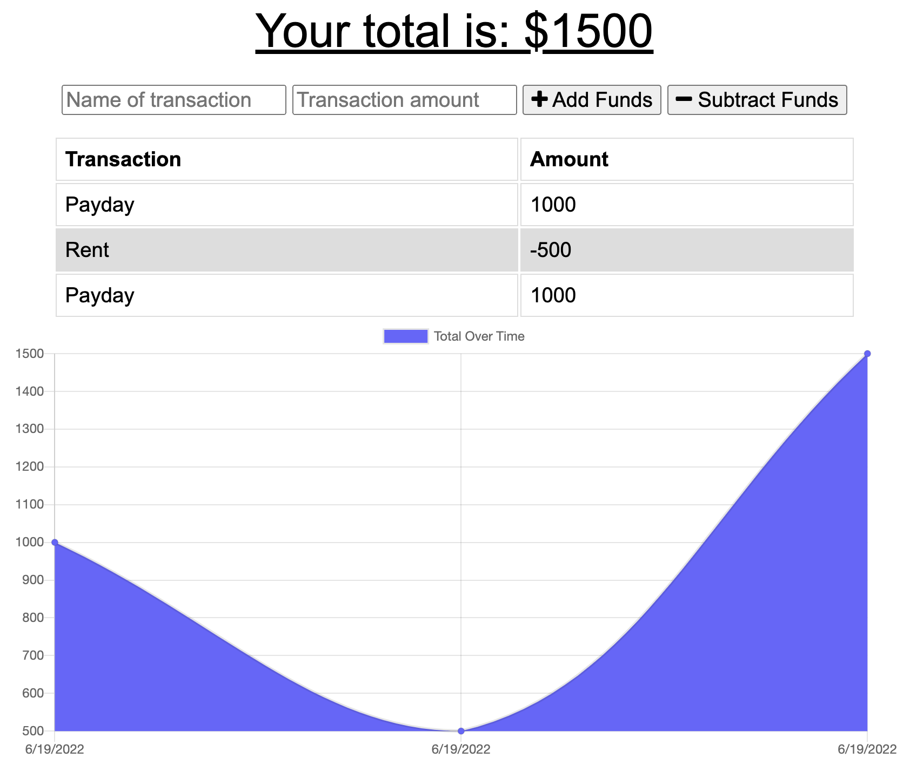

  

![license-badge]

  <h1 align="center">Budget Tracker</h1>

  <!-- TABLE OF CONTENTS -->
  

    
Table of Contents

    <ul>
      <li><a href="#description">Description</a></li>
      <li><a href="#installation">Installation</a></li>
      <li><a href="#usage">Usage</a></li>
      <li><a href="#license">License</a></li>
      <li><a href="#questions">Questions</a></li>
    </ul>
  

   
  
  ## Description
  Budget Tracker is a progressive web app that makes it easy for you to track your expenses even with a poor internet connection.
  
  ## Installation
To install to homepage look for an icon in the right hand side of the url bar which reads "Install Budget Tracker" when hovered over.
## Usage

The deployed application is available at https://thawing-retreat-30592.herokuapp.com/
Transactions may be added to the app even when offline. They will be uploaded as soon as the network connection is restored on your device.

## License

Licensed under the MIT License.

## Questions

Email: [Mannysg88@gmail.com](mailto:Mannysg88@gmail.com)

Github: [https://github.com/Mannygarcia98](https://github.com/Mannygarcia98)

  <!-- MARKDOWN LINKS & IMAGES -->

[license-badge]: https://img.shields.io/badge/LICENSE-MIT-brightgreen?style=plastic
